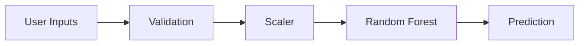

# Feature Engineering

## Project
**A Comprehensive Measure of Well-Being**

## Overview
This document describes the feature engineering of the project.

## Implementation
- Backend: Flask
- Machine Learning: Random Forest Classifier & Regressor
- Dataset: 500 synthetic country records
- Features:
  - Life Expectancy
  - Expected Schooling
  - Mean Schooling
  - GNI Per Capita
- Outputs:
  - HDI Score
  - HDI Category
  - Scientific UNDP HDI
  - ML Prediction

## Mermaid Diagram

## Notes
Prepared for GitHub, internships, SkillWallet and college evaluation.
